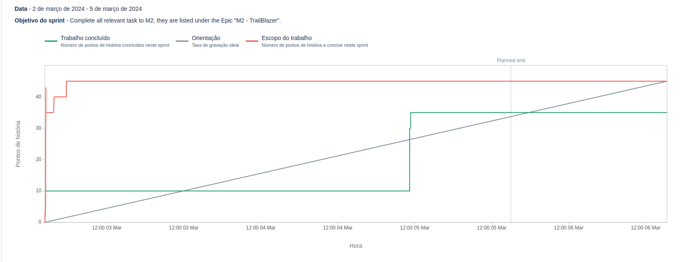

# Sprint 1

**From**: 2024-03-02

**To**: 2024-03-05

**Scrum Master**: Hugo Correia

**Product Owner**: Duarte Cruz

**Developers**: Alexandre Cotorobai, Bernardo Figueiredo, Joaquim Rosa, André Oliveira

## Sprint Planning

In order to complete the second milestone of our project, it is expectable to conclude the following sprints goals:

- Functional requirements
- Non-functional requirements
- Actors and Use Cases
- Data Domain Model
- UI Mockups
- Architecture and Design
- Technology Stack
- State of the Art
- Update all the documentation

| Expected     | Quantity |
| ------------ | -------- |
| Tasks        | 9        |
| Epics        | 1        |
| Story Points | 45       |

## Sprint Backlog

| Task (Trail-\*) | Description                 | Developer                                      | State       | Story Points |
| --------------- | --------------------------- | ---------------------------------------------- | ----------- | ------------ |
| Trail-2         | State of the Art            | Joaquim Rosa                                   | Done        | 5            |
| Trail-3         | Functional Requirements     | Duarte Cruz                                    | Done        | 5            |
| Trail-4         | Actors and Use Cases        | Bernardo Figueiredo                            | Done        | 5            |
| Trail-5         | Architecture                | André Oliveira                                 | Done        | 5            |
| Trail-6         | Non-functional Requirements | Duarte Cruz                                    | Done        | 5            |
| Trail-7         | Data Domain Model           | Alexandre Cotorobai                            | Done        | 5            |
| Trail-8         | UI Mockups                  | Bernardo Figueiredo, Hugo Correia, Duarte Cruz | In progress | 5            |
| Trail-9         | Technologies                | All                                            | Done        | 5            |
| Trail-11        | Update Documentation        | Hugo Correia                                   | In progress | 5            |

### Task Status (Completed/Not Completed)

- [x] Trail-2: State of the Art
- [x] Trail-3: Functional Requirements
- [x] Trail-4: Actors and Use Cases
- [x] Trail-5: Architecture
- [x] Trail-6: Non-functional Requirements
- [x] Trail-7: Data Domain Model
- [x] Trail-9: Technologies
- [ ] Trail-8: UI Mockups
- [ ] Trail-11: Update Documentation

## Sprint Review

| Concluded     | Quantity |
| ------------ | -------- |
| Tasks        | 7        |
| Epics        | 1        |
| Story Points | 35       |

## Sprint Retrospective

This sprint saw substantial completion of tasks, but UI Mockups and documentation updates were not finished due to time constraints as other tasks took longer than expected. The team will look at ways to better estimate the time required for complex tasks and adjust the sprint planning accordingly to ensure all tasks can be completed within the given timeframe. Going forward, this understanding will inform better allocation of efforts across tasks.

## Sprint Burndown Chart

 
