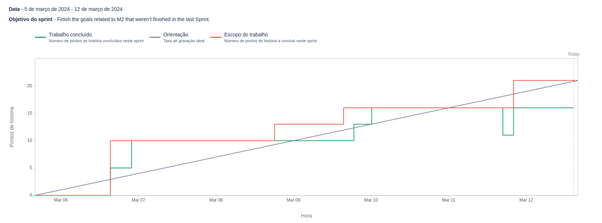

# Sprint 2

**From**: 2024-03-02

**To**: 2024-03-05

**Scrum Master**: André Oliveira

**Product Owner**: Alexandre Cotorobai

**Developers**: Joaquim Rosa, Duarte Cruz, Hugo Correia, Bernardo Figueiredo

## Sprint Goal

In this sprint, we aimed to finish all the tags that were not possible to complete in the previous sprint and some that emerged at the last minute:

- UI Mockups
- Update all the documentation
- LateX Report Repo Creation
- Presentation Preparation
- Use Cases Preparation

| Expected     | Quantity |
| ------------ | -------- |
| Tasks        | 5        |
| Epics        | 1        |
| Story Points | 21       |

## Sprint Backlog

| Task (Trail-\*) | Description                 | Developer                                      | State       | Story Points |
| --------------- | --------------------------- | ---------------------------------------------- | ----------- | ------------ |
| Trail-8         | UI Mockups                  | Bernardo Figueiredo, Hugo Correia, Joaquim Rosa | Done        | 5            |
| Trail-11        | Update Documentation        | Hugo Correia                                   | Done        | 5            |
| Trail-12        | LateX Report Repo Creation  | Bernardo Figueiredo                                    | Done        | 3            |
| Trail-13        | Use Cases Preparation       | Hugo Correia                                    | Done        | 3            |
| Trail-14        | Presentation Preparation    | All team                                    | Done        | 5            |

### Task Status (Completed/Not Completed)

- [x] Trail-8: UI Mockups
- [x] Trail-11: Update Documentation
- [x] Trail-12: LateX Report Repo Creation
- [x] Trail-13: Use Cases Preparation
- [x] Trail-14: Presentation Preparation

## Sprint Review

| Concluded     | Quantity |
| ------------ | -------- |
| Tasks        | 5        |
| Epics        | 1        |
| Story Points | 21       |

## Sprint Restrospective

In this sprint, we managed to complete all the tasks that were planned. The team worked well together and managed to finish the sprint goals on time. The presentation was prepared and the documentation was updated. The LateX report repository was created and the use cases were prepared. The UI mockups were also completed.

## Sprint Burnup Chart

