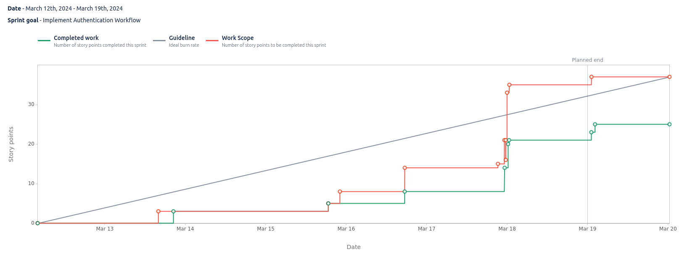

# Sprint 3

**From**: 2024-03-12

**To**: 2024-03-19

**Scrum Master**: Bernardo Figueiredo

**Product Owner**: Joaquim Rosa

**Developers**: Duarte Cruz, Hugo Correia, Alexandre Cotorobai, André Oliveira

## Sprint Goal

In this sprint, we started coding implementation of our project, beginning with the implementation of user authentication and the user_microservice:

- Setup user_microservice repo
- Implement User Get Endpoint in User CRUD Microservice
- Schemas and Models of User Database
- Implement User Registration Endpoint in User CRUD Microservice
- Setup postgreSQL User Database
- Setup web_ui repository
- Create registration page
- Update LaTeX Report
- Create login page
- Create Front page

| Expected     | Quantity |
| ------------ | -------- |
| Tasks        | 10       |
| Epics        | 1        |
| Story Points | 39       |

## Sprint Backlog

| Task (Trail-\*) | Description                                                    | Developer           | State    | Story Points |
| --------------- | -------------------------------------------------------------- | ------------------- | -------- | ------------ |
| Trail-16        | Setup user_microservice repo                                   | Bernardo Figueiredo | Done     | 3            |
| Trail-27        | Implement User Get Endpoint in User CRUD Microservice          | Duarte Cruz         | Done     | 2            |
| Trail-26        | Schemas and Models of User Database                            | Alexandre Cotorobai | Done     | 2            |
| Trail-17        | Implement User Registration Endpoint in User CRUD Microservice | André Oliveira      | Done     | 2            |
| Trail-19        | Setup postgreSQL User Database                                 | Alexandre Cotorobai | Done     | 2            |
| Trail-21        | Setup web_ui repository                                        | Bernardo Figueiredo | Done     | 3            |
| Trail-22        | Create registration page                                       | Bernardo Figueiredo | Done     | 6            |
| Trail-23        | Update LaTeX Report                                            | Bernardo Figueiredo | Done     | 1            |
| Trail-24        | Create login page                                              | Hugo Correia        | Done     | 6            |
| Trail-25        | Create Front page                                              | Hugo Correia        | Not Done | 12           |

### Task Status (Completed/Not Completed)

- [x] Trail-16: Setup user_microservice repo
- [x] Trail-27: Implement User Get Endpoint in User CRUD Microservice
- [x] Trail-26: Schemas and Models of User Database
- [x] Trail-17: Implement User Registration Endpoint in User CRUD Microservice
- [x] Trail-19: Setup postgreSQL User Database
- [x] Trail-21: Setup web_ui repository
- [x] Trail-22: Create registration page
- [x] Trail-23: Update LaTeX Report
- [x] Trail-24: Create login page
- [ ] Trail-25: Create Front page

## Sprint Review

| Expected     | Quantity |
| ------------ | -------- |
| Tasks        | 9        |
| Epics        | 1        |
| Story Points | 39       |

## Sprint Retrospective

In this sprint, we managed to complete all the tasks that were planned, except for an additional task that was added at the last minute and was not part of the goals of this sprint. The team worked well together and managed to finish the sprint goals on time.

## Sprint Burnup Chart

