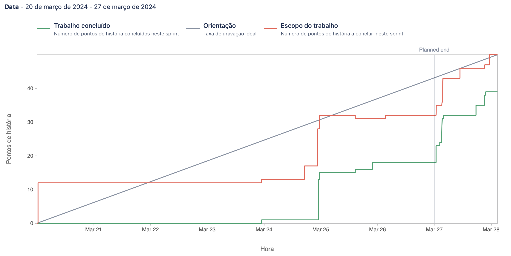

# Sprint 1

**From**: 2024-03-28

**To**: 2024-04-04

**Scrum Master**: Duarte Cruz

**Product Owner**: Bernardo Figueiredo

**Developers**: André Oliveira, Alexandre Cotorobai, Joaquim Rosa, Duarte Cruz

## Sprint Goal

In this sprint, we continued with the implementation of our project code, taking into account the personalized recommendation and all processes related to the offers:

- Create Front page
- Setup recommender_microservice repo
- fix endpoint get user recommendations
- Create endpoint in Recommender Microservice to get the most popular offers
- Setup offer_microservice repo
- Beautify Login and Register Pages
- Create NavBar
- Schemas and Models of Offer Database
- Elasticsearch compose configuration
- Update Documentation Sprint 3
- Refactor Compose and Dockerfiles
- Add Skeleton Effect to Pages
- Fix User Register
- Create endpoint in Recommender Microservice to get the user recommendation
- Setup rabbitMQ
- Authentication - Clean Code
- Implement Offer GET/PUT Endpoints in Offer CRUD Microservice
- Function to receive new offers on recommender by rabbitMQ

| Expected     | Quantity |
| ------------ | -------- |
| Tasks        | 18       |
| Epics        | 1        |
| Story Points | 50       |

## Sprint Backlog

| Task (Trail-\*) | Description                                                                 | Developer           | State    | Story Points |
| --------------- | --------------------------------------------------------------------------- | ------------------- | -------- | ------------ |
| TRAIL-25        | Create Front page                                                           | Hugo Correia        | Done     | 12           |
| TRAIL-28        | Setup recommender_microservice repo                                         | Alexandre Cotorobai | Done     | 1            |
| Trail-29        | Setup offer_microservice repo                                               | Joaquim Rosa        | Done     | 1            |
| Trail-30        | Schemas and Models of Offer Database                                        | Alexandre Cotorobai | Done     | 3            |
| Trail-31        | Elasticsearch compose configuration                                         | Joaquim Rosa        | Done     | 1            |
| Trail-33        | Create NavBar                                                               | Hugo Correia        | Done     | 2            |
| Trail-34        | Beautify Login and Register Pages                                           | Hugo Correia        | Done     | 5            |
| Trail-35        | Update Documentation Sprint 3                                               | Joaquim Rosa        | Done     | 1            |
| Trail-36        | Refactor Compose and Dockerfiles                                            | Bernardo Figueiredo | Done     | 1            |
| Trail-38        | Add Skeleton Effect to Pages                                                | Hugo Correia        | Done     | 3            |
| Trail-39        | Fix User Register                                                           | André Oliveira      | Done     | 1            |
| Trail-40        | CCreate endpoint in Recommender Microservice to get the most popular offers | André Oliveira      | Done     | 3            |
| Trail-41        | Create endpoint in Recommender Microservice to get the user recommendation  | Duarte Cruz         | Done     | 3            |
| Trail-42        | Setup rabbitMQ                                                              | André Oliveira      | Done     | 1            |
| Trail-43        | fix endpoint get user recommendations                                       | André Oliveira      | Done     | 1            |
| Trail-44        | Function to receive new offers on recommender by rabbitMQ                   | André Oliveira      | Not Done | 3            |
| Trail-32        | Authentication - Clean Code                                                 | Bernardo Figueiredo | Not Done | 4            |
| Trail-37        | Implement Offer GET/PUT Endpoints in Offer CRUD Microservice                | Joaquim Rosa        | Not Done | 3            |

### Task Status (Completed/Not Completed)

- [x] TRAIL-25 Create Front page
- [x] TRAIL-28 Setup recommender_microservice repo
- [x] TRAIL-29 Setup offer_microservice repo
- [x] TRAIL-30 Schemas and Models of Offer Database
- [x] TRAIL-31 Elasticsearch compose configuration
- [x] TRAIL-33 Create NavBar
- [x] TRAIL-34 Beautify Login and Register Pages
- [x] TRAIL-35 Update Documentation Sprint 3
- [x] TRAIL-36 Refactor Compose and Dockerfiles
- [x] TRAIL-38 Add Skeleton Effect to Pages
- [x] TRAIL-39 Fix User Register
- [x] TRAIL-40 Create endpoint in Recommender Microservice to get the most popular offers
- [x] TRAIL-41 Create endpoint in Recommender Microservice to get the user recommendation
- [x] TRAIL-42 Setup rabbitMQ
- [x] TRAIL-43 fix endpoint get user recommendations
- [ ] TRAIL-44 Function to receive new offers on recommender by rabbitMQ
- [ ] TRAIL-32 Authentication - Clean Code
- [ ] TRAIL-37 Implement Offer GET/PUT Endpoints in Offer CRUD Microservice

## Sprint Review

| Expected     | Quantity |
| ------------ | -------- |
| Tasks        | 18       |
| Epics        | 1        |
| Story Points | 39       |

## Sprint Retrospective

In this sprint, we successfully completed the tasks we had planned, achieving our set objectives. Additionally, we were able to initiate the implementation of a message queue system, marking significant progress towards our project goals. This successful sprint underscores our team's efficiency and dedication, positioning us well for future milestones.

## Sprint Burnup Chart

