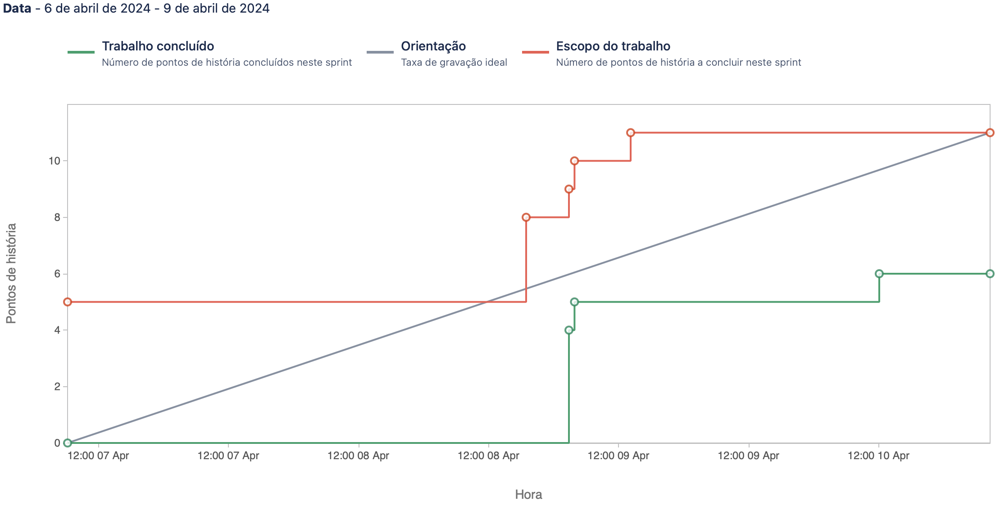

# Sprint 1

**From**: 2024-04-06

**To**: 2024-04-09

**Scrum Master**: Joaquim Rosa

**Product Owner**: André Oliveira

**Developers**: Bernardo Figueiredo, Hugo Correia, Alexandre Cotorobai, Duarte Cruz

## Sprint Goal

The goal of this sprint is to implement the tagging of the offers in the offer microservice, given the offer description. Additionally, we will add the endpoints for the front page and offer details in the offer microservice.

- TRAIL-50 Add Front Page Endpoints
- TRAIL-57 Add Offer Details Endpoints
- TRAIL-60 Implement tagging in offer microservice given the offer description
- TRAIL-61 Update sprint 5 documentation

| Expected     | Quantity |
| ------------ | -------- |
| Tasks        | 4        |
| Epics        | 1        |
| Story Points | 11       |

## Sprint Backlog

| Task (Trail-\*) | Description                                                         | Developer      | State    | Story Points |
| --------------- | ------------------------------------------------------------------- | -------------- | -------- | ------------ |
| Trail-60        | Implement tagging in offer microservice given the offer description | Duarte Cruz    | Done     | 5            |
| Trail-61        | Update sprint 5 documentation                                       | André Oliveira | Done     | 1            |
| Trail-57        | Add Offer Details Endpoints                                         | Hugo Correia   | Not Done | 2            |
| Trail-50        | Add Front Page Endpoints                                            | Hugo Correia   | Not Done | 3            |

### Task Status (Completed/Not Completed)

- [x] TRAIL-60 Implement tagging in offer microservice given the offer description
- [x] TRAIL-61 Update sprint 5 documentation
- [ ] TRAIL-57 Add Offer Details Endpoints
- [ ] TRAIL-50 Add Front Page Endpoints

## Sprint Review

| Completed    | Quantity |
| ------------ | -------- |
| Tasks        | 2        |
| Epics        | 1        |
| Story Points | 6        |

## Sprint Retrospective

In this sprint, we were able to complete 2 tasks, which were the implementation of tagging in the offer microservice given the offer description and the update of the sprint 5 documentation. We were not able to complete the tasks of adding the offer details and front page endpoints. We will try to improve our estimations for the next sprint.

## Sprint Burnup Chart

