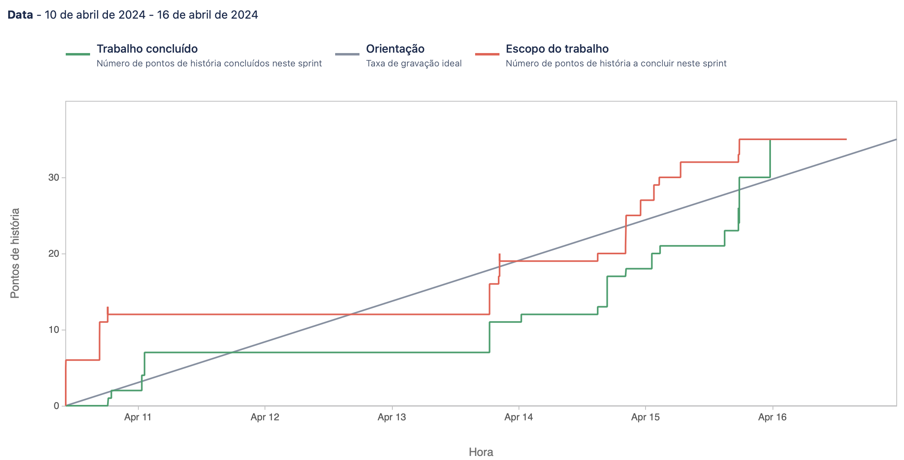

# Sprint 7

**From**: 2024-04-10

**To**: 2024-04-16

**Scrum Master**: André Oliveira

**Product Owner**: Bernardo Figueiredo

**Developers**: Joaquim Rosa, Hugo Correia, Alexandre Cotorobai, Duarte Cruz

## Sprint Goal

The goal of this sprint is to implement machine learning models for auto-tagging reviews and work on the frontend.

- TRAIL-50 Add Front Page Endpoints
- TRAIL-57 Add Offer Details Endpoints
- TRAIL-62 Update sprint 6 documentation
- TRAIL-63 Auto offers rating implementation
- TRAIL-64 Fix to return offer id on a offer GET
- TRAIL-65 Fix auto-tagging
- TRAIL-66 Hot Fixes
- TRAIL-67 Schemas refactor
- TRAIL-68 Add Your Offer Page
- TRAIL-69 Update Navbar Depending on User
- TRAIL-70 Add Recommendations Assessment Component
- TRAIL-71 Add Create and Delete Offer Endpoints
- TRAIL-73 Fix connection between offer and recommender to insert new offers in ES
- TRAIL-76 FIX - ML connection refactor
- TRAIL-77 Create calendar in microsite
- TRAIL-78 Clean poetry lock of offer service
- TRAIL-79 FIX - Get Offers by User Endpoint
- TRAIL-81 Add Create Review and Delete Review Endpoints

| Expected     | Quantity |
| ------------ | -------- |
| Tasks        | 18       |
| Epics        | 1        |
| Story Points | 36       |

## Sprint Backlog

| Task (Trail-\*) | Description                                                             | Developer           | State | Story Points |
| --------------- | ----------------------------------------------------------------------- | ------------------- | ----- | ------------ |
| Trail-50        | Add Front Page Endpoints                                                | Bernardo Figueiredo | Done  | 3            |
| Trail-57        | Add Offer Details Endpoints                                             | Hugo Correia        | Done  | 4            |
| Trail-62        | Update sprint 6 documentation                                           | André Oliveira      | Done  | 1            |
| Trail-63        | Auto offers rating implementation                                       | André Oliveira      | Done  | 3            |
| Trail-64        | Fix to return offer id on a offer GET                                   | André Oliveira      | Done  | 2            |
| Trail-65        | Fix auto-tagging                                                        | Duarte Cruz         | Done  | 1            |
| Trail-66        | Hot Fixes                                                               | Alexandre Cotorobai | Done  | 4            |
| Trail-67        | Schemas refactor                                                        | Alexandre Cotorobai | Done  | 1            |
| Trail-68        | Add Your Offer Page                                                     | Hugo Correia        | Done  | 4            |
| Trail-69        | Update Navbar Depending on User                                         | Hugo Correia        | Done  | 1            |
| Trail-70        | Add Recommendations Assessment Component                                | Bernardo Figueiredo | Done  | 2            |
| Trail-71        | Add Create and Delete Offer Endpoints                                   | Hugo Correia        | Done  | 2            |
| Trail-73        | Fix connection between offer and recommender to insert new offers in ES | Duarte Cruz         | Done  | 1            |
| Trail-76        | FIX - ML connection refactor                                            | Alexandre Cotorobai | Done  | 1            |
| Trail-77        | Create calendar in microsite                                            | Bernardo Figueiredo | Done  | 2            |
| Trail-78        | Clean poetry lock of offer service                                      | Bernardo Figueiredo | Done  | 1            |
| Trail-79        | FIX - Get Offers by User Endpoint                                       | Bernardo Figueiredo | Done  | 1            |
| Trail-81        | Add Create Review and Delete Review Endpoints                           | Hugo Correia        | Done  | 2            |

### Task Status (Completed/Not Completed)

- [x] TRAIL-50 Add Front Page Endpoints
- [x] TRAIL-57 Add Offer Details Endpoints
- [x] TRAIL-62 Update sprint 6 documentation
- [x] TRAIL-63 Auto offers rating implementation
- [x] TRAIL-64 Fix to return offer id on a offer GET
- [x] TRAIL-65 Fix auto-tagging
- [x] TRAIL-66 Hot Fixes
- [x] TRAIL-67 Schemas refactor
- [x] TRAIL-68 Add Your Offer Page
- [x] TRAIL-69 Update Navbar Depending on User
- [x] TRAIL-70 Add Recommendations Assessment Component
- [x] TRAIL-71 Add Create and Delete Offer Endpoints
- [x] TRAIL-73 Fix connection between offer and recommender to insert new offers in ES
- [x] TRAIL-76 FIX - ML connection refactor
- [x] TRAIL-77 Create calendar in microsite
- [x] TRAIL-78 Clean poetry lock of offer service
- [x] TRAIL-79 FIX - Get Offers by User Endpoint
- [x] TRAIL-81 Add Create Review and Delete Review Endpoints

## Sprint Review

| Completed    | Quantity |
| ------------ | -------- |
| Tasks        | 18       |
| Epics        | 1        |
| Story Points | 36       |

## Sprint Retrospective

In this sprint we were able to complete all the tasks, which were the implementation of the endpoints for the front page and offer details in the offer microservice, the auto-tagging of the offers in the offer microservice, given the offer description, and the update of the sprint 6 documentation. We were also able to complete the hot fixes, schemas refactor, add your offer page, update navbar depending on user, add recommendations assessment component, add create and delete offer endpoints, fix connection between offer and recommender to insert new offers in ES, fix ML connection refactor, create calendar in microsite, clean poetry lock of offer service, fix get offers by user endpoint, and add create review and delete review endpoints. We were able to complete all the tasks in this sprint, which was a great achievement for the team.

## Sprint Burnup Chart

