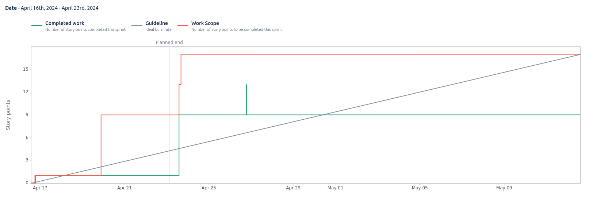

# Sprint 8

**From**: 2024-04-16

**To**: 2024-04-23

**Scrum Master**: Bernardo Figueiredo

**Product Owner**: Joaquim Rosa

**Developers**: Duarte Cruz, Hugo Correia, Alexandre Cotorobai, André Oliveira

## Sprint Goal

In this sprint, we just focused on updating the documentation and implementing custom token generation in the User Microservice.

- Trail-85 Update sprint 7 documentation
- Trail-86 Implement custom token generation in User Microservice

| Expected     | Quantity |
| ------------ | -------- |
| Tasks        | 2        |
| Epics        | 1        |
| Story Points | 9        |

## Sprint Backlog

| Task (Trail-\*) | Description                                            | Developer           | State | Story Points |
| --------------- | ------------------------------------------------------ | ------------------- | ----- | ------------ |
| Trail-85        | Update sprint 7 documentation                          | André Oliveira      | Done  | 1            |
| Trail-86        | Implement custom token generation in User Microservice | Bernardo Figueiredo | Done  | 8            |

### Task Status (Completed/Not Completed)

- [x] Trail-85: Update sprint 7 documentation
- [x] Trail-86: Implement custom token generation in User Microservice

## Sprint Review

| Completed    | Quantity |
| ------------ | -------- |
| Tasks        | 2        |
| Epics        | 1        |
| Story Points | 9        |

## Sprint Retrospective

In this sprint, although we had a small number of tasks, the token generation implementation was a crucial feature for the project as a whole.

## Sprint Burnup Chart

