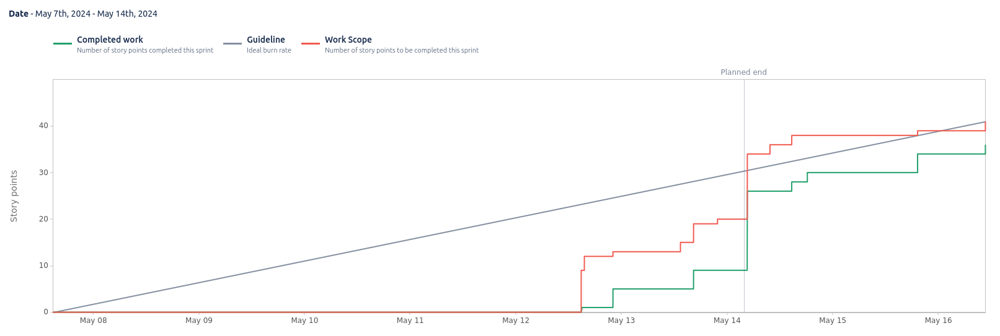

# Sprint 9

**From**: 2024-05-07

**To**: 2024-05-14

**Scrum Master**: Alexandre Cotorobai

**Product Owner**: Joaquim Rosa

**Developers**: Duarte Cruz, Hugo Correia, Bernardo Figueiredo, André Oliveira

## Sprint Goal

In this sprint, we started started the implementation of the payment and the monitoring microservices.

- Trail-87 Add workflows for QA to repos
- Trail-90 Setup MongoDB Database and Monitor Repository
- Trail-111 Offload Machine Learning models to another API
- Trail-100 RabbitMQ sending offers to datawarehouse
- Trail-101 Add RabbitMQ config to monitor_microservice and receive offers from offer_microservice
- Trail-103 Offer endpoints for monitor_microservice
- Trail-104 Setup payment in deployment
- Trail-106 Payment implementation
- Trail-107 Update Authorization in Offer endpoints
- Trail-92 Create Static version of Account Menu
- Trail-102 Small Design Changes
- Trail-91 Change Overall Color Pallete
- Trail-108 Fix create and update offer image and add delete
- Trail-109 Fix homepage null handling and add badge to offer selection

| Expected     | Quantity |
| ------------ | -------- |
| Tasks        | 14       |
| Epics        | 1        |
| Story Points | 43       |

## Sprint Backlog

| Task (Trail-\*) | Description                                                                            | Developer           | State | Story Points |
| --------------- | -------------------------------------------------------------------------------------- | ------------------- | ----- | ------------ |
| Trail-87        | Add workflows for QA to repos                                                          | Bernardo Figueiredo | Done  | 4            |
| Trail-90        | Setup MongoDB Database and Monitor Repository                                          | Joaquim Rosa        | Done  | 4            |
| Trail-111       | Offload Machine Learning models to another API                                         | Bernardo Figueiredo | Done  | 2            |
| Trail-100       | RabbitMQ sending offers to datawarehouse                                               | Alexandre Cotorobai | Done  | 1            |
| Trail-101       | Add RabbitMQ config to monitor_microservice and receive offers from offer_microservice | Joaquim Rosa        | Done  | 1            |
| Trail-103       | Offer endpoints for monitor_microservice                                               | Joaquim Rosa        | Done  | 4            |
| Trail-104       | Setup payment in deployment                                                            | Duarte Cruz         | Done  | 1            |
| Trail-106       | Payment implementation                                                                 | Duarte Cruz         | Done  | 6            |
| Trail-107       | Update Authorization in Offer endpoints                                                | Bernardo Figueiredo | Done  | 2            |
| Trail-92        | Create Static version of Account Menu                                                  | Hugo Correia        | Done  | 11           |
| Trail-102       | Small Design Changes                                                                   | Hugo Correia        | Done  | 1            |
| Trail-91        | Change Overall Color Pallete                                                           | Hugo Correia        | Done  | 2            |
| Trail-108       | Fix create and update offer image and add delete                                       | Joaquim Rosa        | Done  | 3            |
| Trail-109       | Fix homepage null handling and add badge to offer selection                            | Bernardo Figueiredo | Done  | 1            |

### Task Status (Completed/Not Completed)

- [x] Trail-87: Add workflows for QA to repos
- [x] Trail-90: Setup MongoDB Database and Monitor Repository
- [x] Trail-111: Offload Machine Learning models to another API
- [x] Trail-100: RabbitMQ sending offers to datawarehouse
- [x] Trail-101: Add RabbitMQ config to monitor_microservice and receive offers from offer_microservice
- [x] Trail-103: Offer endpoints for monitor_microservice
- [x] Trail-104: Setup payment in deployment
- [x] Trail-106: Payment implementation
- [x] Trail-107: Update Authorization in Offer endpoints
- [x] Trail-92: Create Static version of Account Menu
- [x] Trail-102: Small Design Changes
- [x] Trail-91: Change Overall Color Pallete
- [x] Trail-108: Fix create and update offer image and add delete
- [x] Trail-109: Fix homepage null handling and add badge to offer selection

## Sprint Review

| Completed    | Quantity |
| ------------ | -------- |
| Tasks        | 14       |
| Epics        | 1        |
| Story Points | 43       |

## Sprint Retrospective

In this sprint, we managed to complete all the tasks we had planned. The team worked well together and we were able to deliver all the features we had planned. The team is working well together and we are looking forward to the next sprint.

## Sprint Burnup Chart

