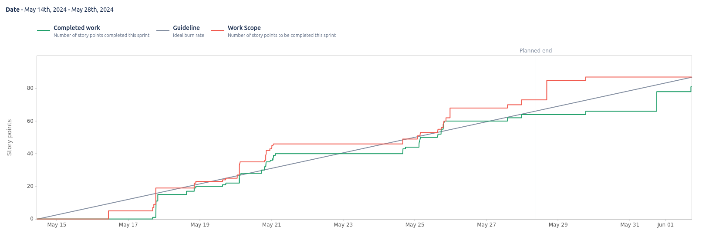

# Sprint 10

**From**: 2024-05-14

**To**: 2024-05-28

**Scrum Master**: Hugo Correia

**Product Owner**: Duarte Cruz

**Developers**: Bernardo Figueiredo, Joaquim Rosa, Alexandre Cotorobai, André Oliveira

## Sprint Goal

The goal of this sprint is to implement the remaining features and fix any bugs that may arise. We will also work on the promotional video and demo to showcase the project.

- TRAIL-136 Fix Similar offers (Web)
- TRAIL-151 Message from payment to recommender
- TRAIL-162 Get endpoint to return payments by offerid
- TRAIL-135 Create monitor endpoints for provider
- TRAIL-88 Add put Endpoints to Reviews
- TRAIL-89 Add put Endpoint to Offer
- TRAIL-150 Normal Users cant access the sidebar
- TRAIL-132 Fix image upload (Web)
- TRAIL-147 Use google trends to return difference of tendencies to the predictor
- TRAIL-131 Add Get Endpoint to return similar offers 
- TRAIL-113 Usability Tests Feedback Changes
- TRAIL-121 Update Recommender Endpoint to use right tags
- TRAIL-110 Fix Can't Delete offers with reviews
- TRAIL-123 Create User Update Endpoint
- TRAIL-124 Add Update Endpoint to User Account
- TRAIL-125 Refactor monitor endpoints
- TRAIL-126 Add payments to monitor's graphical analysis endpoint
- TRAIL-127 Add connection between monitor and payment with rabbit
- TRAIL-133 Add For you Endpoint to Landing Page
- TRAIL-134 Add endpoints for statistics cards
- TRAIL-148 Creation of fake data generator
- TRAIL-137 Add default image to offer Card
- TRAIL-138 Add Description and Doubts to Reccommendation Assessment
- TRAIL-139 Add all the Information needed to Monotoring Dashboard
- TRAIL-140 Handle "Can´t post more than one review"
- TRAIL-141 Handling if email already exist
- TRAIL-142 Comment input hover comments 
- TRAIL-143 Remove own offer from the similar offers
- TRAIL-144 If logout in the landing page, refresh it
- TRAIL-145 Images Management Feedback
- TRAIL-146 Infinite Scrolling on All Offers Page
- TRAIL-149 Fix centralized Card when provider ony has one
- TRAIL-152 Fix Reviews Logo and wont appear comment Input if not logged
- TRAIL-153 Fix login page - error message when password is wrong
- TRAIL-154 Only can change the user information if the password is the right one
- TRAIL-155 Create Buy a Offer Endpoint
- TRAIL-158 Fix LandingPage BackGround Images
- TRAIL-159 Transition's History Page
- TRAIL-160 Promotional Video / Demo 
- TRAIL-161 Add Predictor to DMO and Provider Graphical Analysis

| Expected     | Quantity |
| ------------ | -------- |
| Tasks        | 40       |
| Epics        | 1        |
| Story Points | 88       |

## Sprint Backlog

| Task (Trail-\*) | Description                                                           | Developer           | State | Story Points |
| --------------- | --------------------------------------------------------------------- | ------------------- | ----- | ------------ |
| Trail-136       | Fix Similar offers (Web)                                              | Bernardo Figueiredo | Done  | 1            |
| Trail-151       | Message from payment to recommender                                   | André Oliveira      | Done  | 1            |
| Trail-162       | Get endpoint to return payments by offerid                            | André Oliveira      | Done  | 2            |
| Trail-135       | Create monitor endpoints for provider                                 | Joaquim Rosa        | Done  | 3            |
| Trail-88        | Add put Endpoints to Reviews                                          | Hugo Correia        | Done  | 2            |
| Trail-89        | Add put Endpoint to Offer                                             | Hugo Correia        | Done  | 2            |
| Trail-150       | Normal Users cant access the sidebar                                  | Hugo Correia        | Done  | 1            |
| Trail-132       | Fix image upload (Web)                                                | Bernardo Figueiredo | Done  | 2            |
| Trail-147       | Use google trends to return difference of tendencies to the predictor | André Oliveira      | Done  | 3            |
| Trail-131       | Add Get Endpoint to return similar offers                             | André Oliveira      | Done  | 1            |
| Trail-113       | Usability Tests Feedback Changes                                      | Hugo Correia        | Done  | 10           |
| Trail-121       | Update Recommender Endpoint to use right tags                         | Bernardo Figueiredo | Done  | 1            |
| Trail-110       | Fix Can't Delete offers with reviews                                  | Bernardo Figueiredo | Done  | 2            |
| Trail-123       | Create User Update Endpoint                                           | Bernardo Figueiredo | Done  | 2            |
| Trail-124       | Add Update Endpoint to User Account                                   | Hugo Correia        | Done  | 3            |
| Trail-125       | Refactor monitor endpoints                                            | Joaquim Rosa        | Done  | 1            |
| Trail-126       | Add payments to monitor's graphical analysis endpoint                 | Joaquim Rosa        | Done  | 5            |
| Trail-127       | Add connection between monitor and payment with rabbit                | Duarte Cruz         | Done  | 1            |
| Trail-133       | Add For you Endpoint to Landing Page                                  | Hugo Correia        | Done  | 1            |
| Trail-134       | Add endpoints for statistics cards                                    | Joaquim Rosa        | Done  | 2            |
| Trail-148       | Creation of fake data generator                                       | Bernardo Figueiredo | Done  | 1            |
| Trail-137       | Add default image to offer Card                                       | Hugo Correia        | Done  | 1            |
| Trail-138       | Add Description and Doubts to Reccommendation Assessment              | Hugo Correia        | Done  | 1            |
| Trail-139       | Add all the Information needed to Monotoring Dashboard                | Hugo Correia        | Done  | 1            |
| Trail-140       | Handle "Can´t post more than one review"                              | Hugo Correia        | Done  | 1            |
| Trail-141       | Handling if email already exist                                       | Hugo Correia        | Done  | 1            |
| Trail-142       | Comment input hover comments                                          | Hugo Correia        | Done  | 1            |
| Trail-143       | Remove own offer from the similar offers                              | Hugo Correia        | Done  | 1            |
| Trail-144       | If logout in the landing page, refresh it                             | Hugo Correia        | Done  | 1            |
| Trail-145       | Images Management Feedback                                            | Hugo Correia        | Done  | 1            |
| Trail-146       | Infinite Scrolling on All Offers Page                                 | Hugo Correia        | Done  | 2            |
| Trail-149       | Fix centralized Card when provider ony has one                        | Hugo Correia        | Done  | 1            |
| Trail-152       | Fix Reviews Logo and wont appear comment Input if not logged          | Hugo Correia        | Done  | 2            |
| Trail-153       | Fix login page - error message when password is wrong                 | Hugo Correia        | Done  | 1            |
| Trail-154       | Only can change the user information if the password is the right one | Hugo Correia        | Done  | 1            |
| Trail-155       | Create Buy a Offer Endpoint                                           | Hugo Correia        | Done  | 2            |
| Trail-158       | Fix LandingPage BackGround Images                                     | Hugo Correia        | Done  | 2            |
| Trail-159       | Transition's History Page                                             | Hugo Correia        | Done  | 3            |
| Trail-160       | Promotional Video / Demo                                              | Alexandre Cotorobai | Done  | 12           |
| Trail-161       | Add Predictor to DMO and Provider Graphical Analysis                  | Joaquim Rosa        | Done  | 6            |

### Task Status (Completed/Not Completed)

- [x] Trail-136: Fix Similar offers (Web)
- [x] Trail-151: Message from payment to recommender
- [x] Trail-162: Get endpoint to return payments by offerid
- [x] Trail-135: Create monitor endpoints for provider
- [x] Trail-88: Add put Endpoints to Reviews
- [x] Trail-89: Add put Endpoint to Offer
- [x] Trail-150: Normal Users cant access the sidebar
- [x] Trail-132: Fix image upload (Web)
- [x] Trail-147: Use google trends to return difference of tendencies to the predictor
- [x] Trail-131: Add Get Endpoint to return similar offers
- [x] Trail-113: Usability Tests Feedback Changes
- [x] Trail-121: Update Recommender Endpoint to use right tags
- [x] Trail-110: Fix Can't Delete offers with reviews
- [x] Trail-123: Create User Update Endpoint
- [x] Trail-124: Add Update Endpoint to User Account
- [x] Trail-125: Refactor monitor endpoints
- [x] Trail-126: Add payments to monitor's graphical analysis endpoint
- [x] Trail-127: Add connection between monitor and payment with rabbit
- [x] Trail-133: Add For you Endpoint to Landing Page
- [x] Trail-134: Add endpoints for statistics cards
- [x] Trail-148: Creation of fake data generator
- [x] Trail-137: Add default image to offer Card
- [x] Trail-138: Add Description and Doubts to Reccommendation Assessment
- [x] Trail-139: Add all the Information needed to Monotoring Dashboard
- [x] Trail-140: Handle "Can´t post more than one review"
- [x] Trail-141: Handling if email already exist
- [x] Trail-142: Comment input hover comments
- [x] Trail-143: Remove own offer from the similar offers
- [x] Trail-144: If logout in the landing page, refresh it
- [x] Trail-145: Images Management Feedback
- [x] Trail-146: Infinite Scrolling on All Offers Page
- [x] Trail-149: Fix centralized Card when provider ony has one
- [x] Trail-152: Fix Reviews Logo and wont appear comment Input if not logged
- [x] Trail-153: Fix login page - error message when password is wrong
- [x] Trail-154: Only can change the user information if the password is the right one
- [x] Trail-155: Create Buy a Offer Endpoint
- [x] Trail-158: Fix LandingPage BackGround Images
- [x] Trail-159: Transition's History Page
- [x] Trail-160: Promotional Video / Demo
- [x] Trail-161: Add Predictor to DMO and Provider Graphical Analysis

## Sprint Review

| Completed    | Quantity |
| ------------ | -------- |
| Tasks        | 40       |
| Epics        | 1        |
| Story Points | 88       |

## Sprint Retrospective

In this sprint, we had a lot of tasks to complete, but we managed to finish them all. The team worked well together and we were able to deliver all the features that were planned for this sprint. We also had a lot of fun working on the promotional video and demo, which turned out great. Overall, it was a successful sprint and we are looking forward to the next one.

## Sprint Burnup Chart

