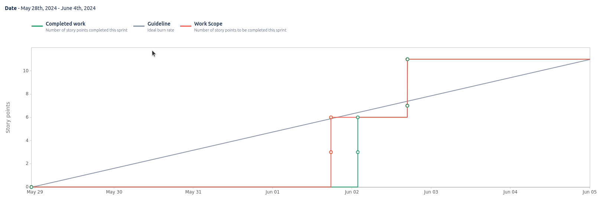

# Sprint 11

**From**: 2024-05-28

**To**: 2024-06-04

**Scrum Master**: Duarte Cruz

**Product Owner**: André Oliveira

**Developers**: Joaquim Rosa, Hugo Correia, Alexandre Cotorobai, Bernardo Figueiredo

## Sprint Goal

The goal of this sprint is to implement the remaining endpoints of the monitoring microservice on the frontend and adds the Transaction page.

- TRAIL-156 Implement All Provider Monitoring Endpoints
- TRAIL-157 Implement All DMOs Monitoring Endpoints
- TRAIL-163 Fix Protected and Provider Routes
- TRAIL-164 Add and Implement My Offer Transactions Page

| Expected     | Quantity |
| ------------ | -------- |
| Tasks        | 4        |
| Epics        | 1        |
| Story Points | 11       |

## Sprint Backlog

| Task (Trail-\*) | Description                                  | Developer    | State | Story Points |
| --------------- | -------------------------------------------- | ------------ | ----- | ------------ |
| Trail-156       | Implement All Provider Monitoring Endpoints  | Hugo Correia | Done  | 3            |
| Trail-157       | Implement All DMOs Monitoring Endpoints      | Hugo Correia | Done  | 3            |
| Trail-163       | Fix Protected and Provider Routes            | Hugo Correia | Done  | 1            |
| Trail-164       | Add and Implement My Offer Transactions Page | Hugo Correia | Done  | 4            |

### Task Status (Completed/Not Completed)

- [x] Trail-156: Implement All Provider Monitoring Endpoints
- [x] Trail-157: Implement All DMOs Monitoring Endpoints
- [x] Trail-163: Fix Protected and Provider Routes
- [x] Trail-164: Add and Implement My Offer Transactions Page

## Sprint Review

| Completed    | Quantity |
| ------------ | -------- |
| Tasks        | 4        |
| Epics        | 1        |
| Story Points | 11       |

## Sprint Retrospective

In this sprint, we managed to complete all the tasks, and finally finished the project. We are proud of the work we have done and the results we have achieved.

## Sprint Burnup Chart

