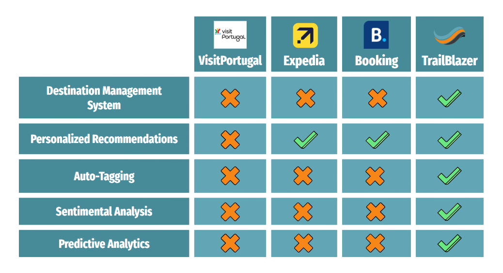

# First Presentation

**Full Apresentation** - [MS1 - Trailblazer](../../../static/pdfs/M1_TrailBlazer.pdf)

## Context

Portugal's economic growth is significantly tied to tourism, as highlighted by Nuno Fazenda, the Secretary of State for Tourism, Trade, and Services, who declared 2023 as "the best year in the history of Portuguese tourism," with a 10% increase compared to the previous peak year, 2019.

In response to this growth, the Recovery and Resilience Plan (PRR) initiated the ATT agenda (Accelerate and Transform Tourism), focusing on the implementation of disruptive and innovative solutions across selected focal points throughout the tourist experience, with our project being a key component of this agenda.

Another crucial aspect is the management of the vast amount of data involved in these processes. A primary focus is the consolidation of this data into a single, isolated location (for each locality) to simplify decision-making regarding activities, infrastructure, transport, etc. Enhancing data aggregation better meets tourists' preferences, making the tourism cycle fully dependent on their involvement and decision-making.

## Problem

Existing tourism support systems face a critical issue: service fragmentation across multiple platforms. For instance, a business that owns both a hostel and a restaurant may have to manage them on separate platforms. This separation complicates data analysis and necessitates managing profiles on multiple platforms, which can be tedious and inconvenient.

Furthermore, Low-Density Population Areas encounter significant challenges in managing their tourism destinations due to infrastructure limitations, sparse populations, and incompatibility with mass tourism models, leading to difficulties in promotion, marketing, and visibility of their tourism destinations.

## Solution

To address the previously mentioned challenges, our platform will integrate various services into a centralized hub, offering a comprehensive view of what the region's tourism has to offer. This centralization simplifies and streamlines the management of diverse services. Furthermore, the consolidation of information enables a deeper data analysis, allowing stakeholders to gain insights into tourist behaviors, preferences, and even predict future trends, thus enhancing decision-making and strategy formulation for the tourism sector.

## Goals

**Goals:**

1. **Personalized Travel Experiences**: Tailor every itinerary to match individual tourist interests, ensuring a unique journey.
2. **Insight into Emerging Trends**: Leverage predictive analytics for informed decision-making across infrastructure development and marketing strategies.
3. **Workflow Optimization**: Enhance efficiency through auto-tagging and sentiment analysis, minimizing manual tasks and improving customer understanding.

## Key Features

- **Personalized Recommendations**: Tailored travel suggestions for a personal experience.
- **Sentiment Analysis**: Continuously refine services by interpreting user feedback for realistic quantitative insights.
- **Predictive Analytics**: Anticipate tourism trends for strategic planning.
- **Optimal Activity Selection**: Highlight the best of each destination for memorable experiences.
- **Market Insights**: Provide valuable data for stakeholders to better understand and serve the market.
- **Auto-Tagging**: Increase recommendation accuracy, making activity and event search more efficient.

## State of Related Work

This section examines the competitive landscape, comparing Trailblazer's comprehensive Destination Management System (DMS) against other market players. Unlike singular service platforms, Trailblazer introduces a centralized DMS, streamlining management across all aspects of a region's tourism services, which is a capability where traditional platforms like Booking and Expedia lack due to their non-isolated systems.

Moreover, Trailblazer uniquely empowers stakeholders by offering a unified solution for purchasing and vending services/activities—addressing a gap that VisitPortugal has not filled. With the added edge of automated features like auto-tagging for activity listings and utilizing sentiment analysis coupled with predictive analytics, Trailblazer is set to revolutionize how tourist trends are anticipated and catered to, positioning itself as a leader in personalized tourism and data-driven decision-making.
