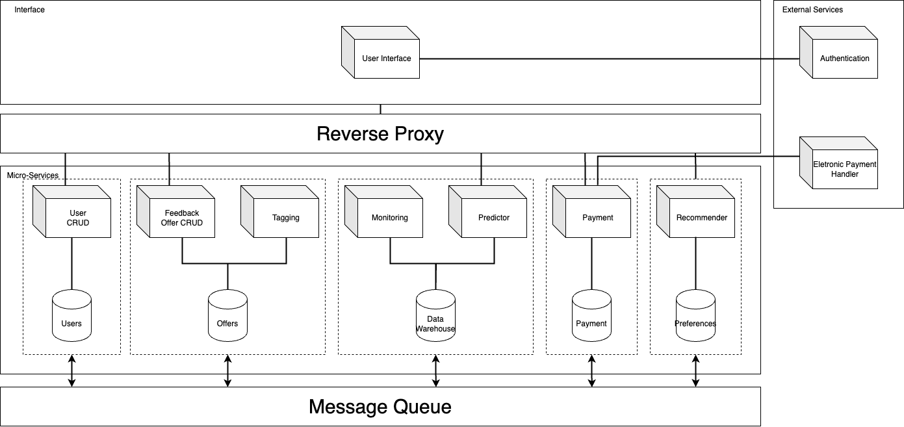

# Architecture

The system in question has two fundamental aspects: one focused on the client-side and another related to data management. The choice of a microservices-based architecture was motivated by the pursuit of independence among various parts of the system, aiming to improve modularity and potential scalability.

In the Presentation Layer, only the User Interface microservice is found, responsible for the system's interaction with the user. This microservice facilitates authentication through an external service and forwards various requests to the next layer.

Next, we have the Business Layer, where communication with the previous layer is mediated by a Reverse Proxy. This approach allows the implementation of Load Balancing, enhancing scalability, and reinforcing security since no service is directly exposed to the client.

Within the Business Layer, various specialized microservices operate. The User CRUD manages all operations in the user database. In turn, the Feedback, Offer CRUD, and Tagging microservices are responsible for auto-tagging offers, database operations, and generating ratings based on user reviews of these offers. The Monitoring and Predictor handle the monitoring of all existing data and the prediction of the same, while the Payment takes care of payment processing using an external service. The Recommender is responsible for providing personalized recommendations to users.

To conclude, a Message Queue has been implemented to promote interaction between the various microservices, ensuring complete independence among them. This approach facilitates communication and collaboration among different components of the system, contributing to a flexible architecture adaptable to project needs.
