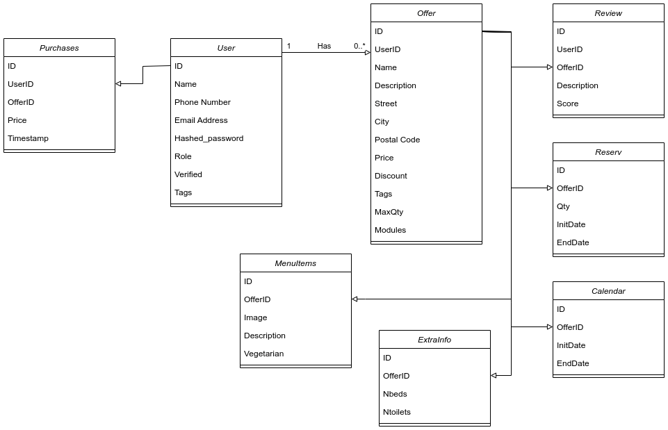

# Data Domain Model

In order to store our data, we will utilize two databases, as described in the following:

**User attributes:** ID, name, phone number, email address, hashed password, role, verified, tags.

**Offer attributes:** ID, userID, name, description, street, city, postal code, price, discount, tags, maxQty, modules.

**Review attributes:** ID, userID, offerID, description, score.

**Reservation attributes:** ID, offerID, qty, initDate, endDate.

**Calendar attributes:** ID, offerID, initDate, endDate.

**Menu item attributes:** ID, offerID, image, description, vegetarian.

**Extra info attributes:** ID, offerID, nbeds, ntoilets.

**Purchase attributes:** ID, userID, offerID, price, timestamp.

The core entities are User, Purchases, Offer, and Review. Users are uniquely identified and can have different roles within the system. Purchases are described with userid-offerid, price and timestamp. Offers can have different modules attached like accommodation info, menu, or calendar. Offers include pricing, potential discounts, and descriptive tags. Reviews allow users to share ratings and textual feedback about their experiences.
