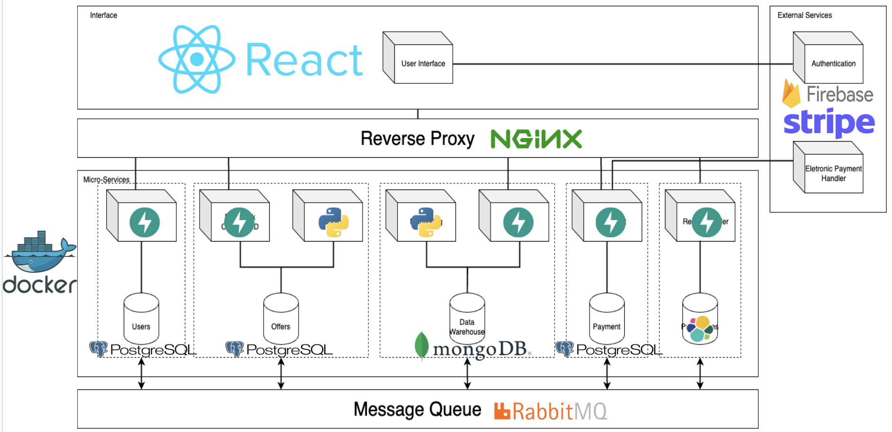

# Technologies Used

**Frontend:** ReactJS (To create a dynamic and engaging user interface, enhancing user experience with its component-based architecture and efficient rendering.)

**Authentication:** Firebase (To ensure secure and seamless user authentication, leveraging its robust security features and support for various authentication methods.)

**Reverse Proxy:** Nginx (To serve as a reverse proxy server, ensuring efficient load balancing and secure communication between the frontend and backend.)

**API's:** FastAPI (Ensure fast and smooth communication between frontend and backend, with its asynchronous capabilities and automatic documentation generation simplifying development and integration.)

**DB’s:** Postgres (Handle large volumes of tourist data efficiently, leveraging its advanced querying features and data integrity enforcement for robust data management.) and MongoDB (Store and manage unstructured data on data warehouse.)

**Payment Processor:** Stripe (Facilitate secure and hassle-free transactions between tourists and attraction providers, benefiting from its developer-friendly APIs and support for various payment methods.)

**Message-Queue:** RabbitMQ (Enable efficient communication between microservices, ensuring scalability and responsiveness in handling data processing tasks across the system.)

**Micro-Services:** Python (For modularity, scalability, and easy integration of machine learning and natural language processing functionalities to support advanced features.)

**Containerization:** Docker (Ensure seamless deployment and management of microservices, leveraging its lightweight and portable containers for efficient resource utilization and scalability.)
