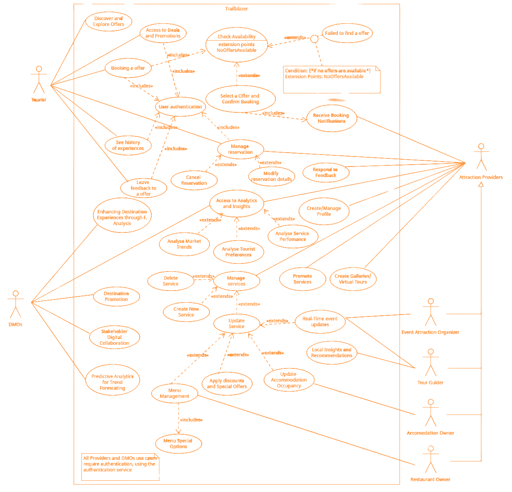

---

sidebar_position: 5

---

# Use Cases

## Use Case UML Diagram
  

## Actors

- Attraction Providers
- DMO
- Tourist

## Attraction Providers

### Common Use Cases

- **UC1: Online Booking and Reservation:** The platform supports direct booking and reservations for tourists, enabling real-time scheduling and payments. Providers receive instant notifications of bookings and can manage them through their dashboard
- **UC2: Feedback and Ratings Management:** after utilizing a service, tourists can leave feedback and ratings which providers can then review and use as a basis for engaging with customers and improving their offerings.
- **UC3:Access to Market Insights:** Access to analytics and insights about their service performance, tourist preferences, and market trends. This data helps in making informed decisions about service adjustments, marketing strategies, and future offerings.
- **UC4: Promotion of Services:** Use the platform to advertise and promote services to a targeted audience.
- **UC5: Registration and Profile Management:** All providers can create and manage their profiles, which include detailed descriptions (Used for Auto-Tagging their service), photos, and other relevant information about their services.
- **UC6: Service Listing and Management**
  - **UC6.1: Cancellation and Modification:** Providers can easily cancel or modify existing reservations, ensuring flexibility and responsiveness to both provider and tourist needs.
  - **UC6.2: Service Listing Updates:** The capability to add new services or remove outdated ones from their listings, allowing providers to keep they offerings current and aligned with the market demand
  - **UC6.3: Listing Management:** Updates to service listings, including availability, pricing and special offers, to accurately reflect the provider’s current offering.
- **UC7: Promotional Offers:** They can also create special offers and discounts to attract more tourists.
- **UC8: Virtual Tours and Galleries:** Create and share interactive content (e.g., videos, blogs, virtual tours, pictures) related to the experiences offered, enhancing engagement and providing value ahead of the actual experience.

### Restaurant Owners

- **UC9: Menu Management:** Restaurant owners can dynamically update and manage their menu listings on the Trailblazer platform, including detailed descriptions, prices, and special dietary options, ensuring tourists have access to the latest offerings.
- **UC10: Menu Special Options:** Utilizing tagging for dietary preferences (e.g vegan, gluten-free options) enhances discoverability and aligns with tourist dietary needs.

### Accommodation Owners (Hotels, Rental Properties)

- **UC11: Update Accommodation Occupancy:** Allows Accommodation Owners to update their listings with the latest occupancy status, ensuring that the availability information provided to potential guests is accurate

### Event and Cultural Attraction Organizers

- **UC12: Real-Time Event Updates:** Provide organizers with the ability to issue real-time updates about event schedules, cancellations, or changes, ensuring attendees always have the most current information.

### Tour Guides and Experience Operators

- **UC13: Live Availability Updates:** Utilize a system for real-time updates on tour availability, enabling last-minute bookings and adjustments to accommodate tourist needs.
- **UC14: Local Insights and Recommendations:** Share local insights and recommendations, positioning themselves as experts and enhancing the overall tourist experience through personalized guidance.

## Tourists

### Use Cases

- **UC15: Discover and Explore Offers:** Tourists can use the platform to discover new destinations, explore attractions, and read about local cultures and experiences, all tailored to their interests and preferences
- **UC16: Personalized Recommendations:** Based on their profiles, past activities, and preferences, tourists receive personalized recommendations for destinations, dining, accommodations, and experiences.
- **UC17: Booking and Reservation Management:** Tourists can book and manage reservations for accommodations, dining, tours, and events directly through the platform, with options for easy modifications and cancellations.
- **UC18: Feedback Submission (Qualitative):** After experiencing services, tourists can submit feedback, contributing to the community, influencing future offerings and give new tags to the service under evaluation.
- **UC19: Access to Deals and Promotions:** Receive notifications and access exclusive deals and promotions tailored to their interests, helping to maximize the value of their travel experiences.
- **UC20: See History of Experiences:** Tourists can see their previous experiences that they booked/paid for.

## DMOs

### Use Cases

- **UC21: Access to Market Insights:** Focuses on analyzing current market conditions and trends based on existing data. It helps in understanding the present market scenario, tourist behavior, and preferences to make informed decisions for immediate strategies or operational changes.
- **UC22: Predictive Analytics for Trend Forecasting:** This extends beyond current insights to predict future market trends and behaviors using advanced data modeling techniques. It is used for long-term strategic planning, anticipating future demands, and preparing for upcoming market shifts to ensure sustainable growth and competitiveness.
- **UC23: Stakeholder Digital Collaboration:** Enables DMOs to use Trailblazer as a platform to coordinate with local businesses, government agencies, and other stakeholders. Through the system, DMOs can share data, discuss strategies, and collectively promote sustainable tourism initiatives, ensuring a unified approach to destination development and marketing.
- **UC24: Enhancing Destination Experience through Feedback Analysis:** Utilize tourist feedback and sentiment analysis to improve destination offerings and address areas of concern, ensuring a high-quality experience for visitors.
- **UC25: Verify Attraction Provider Authenticity:** Accepts or denies provider account creation based on information provided to prevent fake profiles and scammers.
