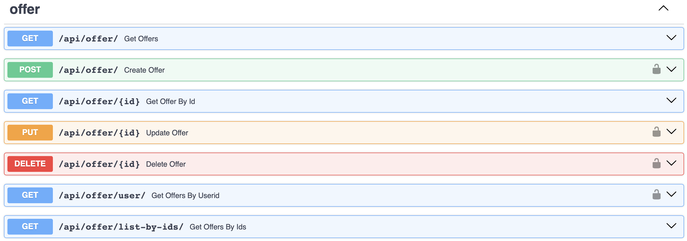
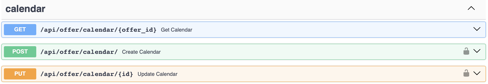
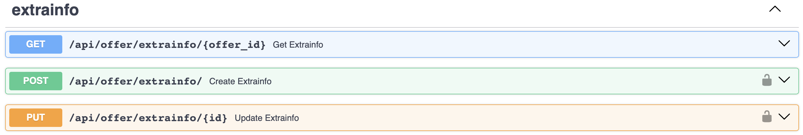
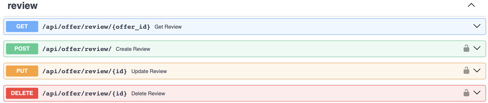
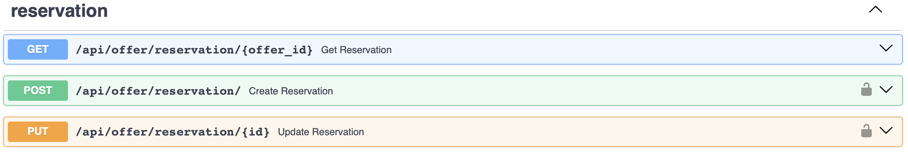
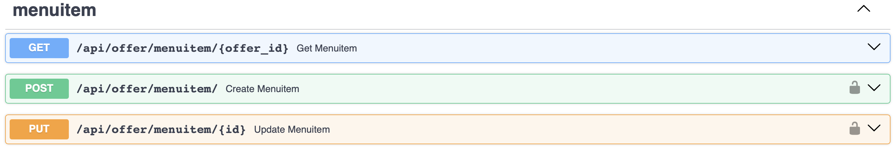
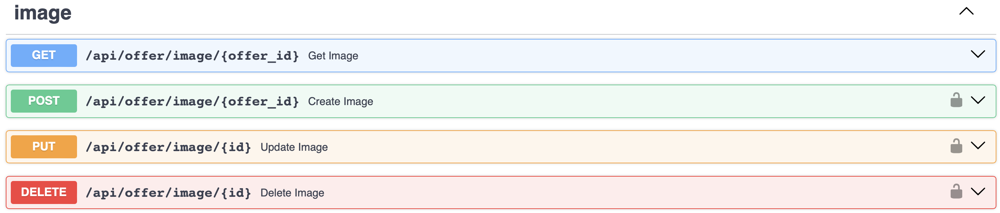

# Offer Microservice

## Introduction

This microservice is responsible for managing offers, including attractions, accommodations, and activities. It handles offer creation, modification, and deletion, as well as database opera- tions related to offers. Interacts with the User Interface microservice to display offers to users and receive user feedback and communicates with other microservices via RabbitMQ. It was also implemented using FastAPI and PostgreSQL for the database. In this microservice there is also a module for auto-tagging and retrieving feedback from users.

## Auto-tagging

Auto-Tagging plays a crucial role in enhancing the functionality and us- ability of the system by automatically assigning tags to offers based on their content. This process leverages advanced natural language processing (NLP) techniques to extract rele- vant keywords and phrases from offer descriptions and then categorize them into predefined tags. These tags serve multiple purposes, including improving search functionality, enhancing recommendation accuracy, and providing additional information to users about the offers.

The heart of the Auto-Tagging system lies in its interaction with the Offer microservice, where it updates offer tags and ensures consistency across the platform. This integration en- ables the system to efficiently manage and organize a large volume of offers while maintaining accuracy and relevance.

For the task of auto-tagging, the system utilizes Facebook’s NLI-based Zero-Shot Text Classification Model, powered by the BART (Bidirectional and Auto-Regressive Trans- formers) architecture. BART is a state-of-the-art pretrained model that has been specifically designed for various natural language processing tasks, including natural language inference (NLI). In this context, text classification is achieved by pairing a document (offer description) with a potential label (tag) and feeding it into the NLI model. The label serves as the hypoth- esis, while the text to be classified acts as the premise. The model then evaluates whether the label accurately represents the content of the text.

One of the primary advantages of this approach is its ability to handle zero-shot learning, meaning it can classify texts into categories that were not explicitly seen during the model’s training phase. This flexibility is invaluable in real-world scenarios where new categories may emerge or existing ones may evolve over time. It empowers the system to adapt seamlessly to changing requirements and ensures that it remains agile and responsive to user needs.

The predefined tags used for categorizing offers encompass a wide range of categories that are pertinent to tourism and hospitality. These include:
These tags have been carefully selected to cover diverse aspects of travel and leisure ex- periences, enabling the system to comprehensively categorize offers and facilitate seamless user navigation and searchability. By leveraging these tags, the system can deliver more pre- cise and relevant recommendations to users, thereby enriching their overall experience and satisfaction.

<table>
  <tr>
    <td>Accommodation</td>
    <td>Sports</td>
    <td>Adventure</td>
  </tr>
  <tr>
    <td>Food</td>
    <td>Wellness</td>
    <td>Transportation</td>
  </tr>
  <tr>
    <td>Drinks</td>
    <td>Cafe</td>
    <td>Games</td>
  </tr>
</table>

## Feedback Analysis with Vader Sentiment Analysis

Feedback Analysis, powered by Vader Sentiment Analysis, is a critical component of the system responsible for compre- hensively understanding user sentiments expressed in their feedback. Leveraging advanced natural language processing techniques, this module meticulously scrutinizes user reviews to discern the underlying sentiments—whether positive, negative, or neutral—embedded within the text.

Vader (Valence Aware Dictionary and Sentiment Reasoner) stands out as a powerful rule- based sentiment analysis tool specifically tailored for analyzing social media texts. Unlike traditional sentiment analysis methods, Vader is adept at capturing the nuanced sentiment nuances prevalent in user-generated content, making it well-suited for analyzing feedback within our platform context.

The essence of Vader lies in its pre-trained sentiment analysis model, which furnishes sentiment scores indicative of the polarity of the expressed sentiment in the text. These sentiment scores are derived from a meticulously curated dictionary of words and associated valence scores, ranging from -4 (most negative) to +4 (most positive). Additionally, Vader takes into account the intensity of sentiment, factoring in cues such as capitalization and punctuation, which can amplify or attenuate the perceived sentiment intensity.

Through the systematic application of Vader Sentiment Analysis, the system is adept at distilling rich sentiment insights from user feedback, thereby enabling a granular understand- ing of user satisfaction levels and sentiment trends associated with various offers.

## API Endpoints

