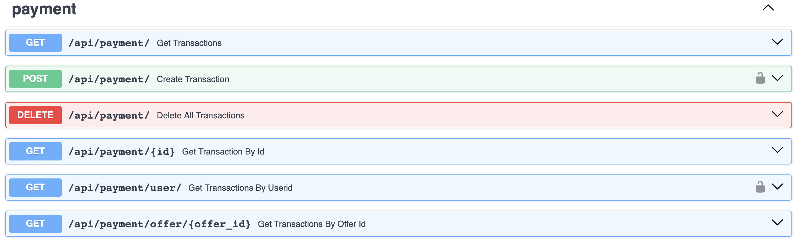

# Payment Microservice

## Introduction

The payment microservice is responsible for handling payment transactions between users and attraction providers. It integrates with the Stripe API [16] to facilitate secure and seamless payment processing, ensuring a smooth user experience. The payment microservice interacts with the User Interface microservice to initiate payment transactions and update payment status. It was implemented using FastAPI and Stripe for payment processing.

## API Endpoints

