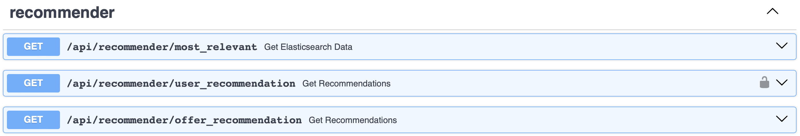

# Recommender Microservice

## Introduction

The Recommender Microservice plays a pivotal role in enhancing user engagement and sat- isfaction by delivering personalized recommendations tailored to each user’s preferences and interests. This microservice leverages algorithms and data-driven approaches to analyze user behavior, past interactions, and feedback to generate relevant recommendations.

## User Preference Acquisition

Upon user registration, a curated selection of offers resembling the Netflix-style recommendation interface is presented to the user. In this intuitive interface, users are prompted to browse through a variety of offers and indicate their pref- erences by selecting the ones that pique their interest. These user-selected preferences serve as valuable input for the recommendation engine, enabling it to understand the user’s tastes, preferences, and interests more comprehensively.

## Tag Assignment

As users interact with the platform and select offers based on their pref- erences, the Recommender Microservice employs a sophisticated tagging mechanism to assign relevant tags to each offer. These tags encapsulate the thematic essence and key attributes of the offers, facilitating efficient categorization and retrieval during the recommendation pro- cess. The tags assigned to offers serve as pivotal metadata that enriches the recommendation engine’s understanding of offer content and user preferences.

## Recommendation Generation

Drawing upon the user’s preferences, past behavior, and tagged attributes of offers, the Recommender Microservice utilizes Elasticsearch powerful and scalable search engine—to index and search for offers that closely align with the user’s profile. Elasticsearch’s advanced search capabilities enable the microservice to efficiently retrieve offers that match the user’s preferences, ensuring that the recommendations are highly relevant and tailored to the user’s individual tastes.

## Dynamic Offer Ranking

In addition to personalized recommendations, the Recommender Microservice employs dynamic offer ranking mechanisms to prioritize and showcase offers based on their popularity and relevance. Elasticsearch’s robust indexing and scoring mecha- nisms enable the microservice to rank offers based on various factors, including user engagement metrics, offer popularity, and similarity to the user’s past interactions. This dynamic ranking ensures that the most compelling and relevant offers are prominently featured to enhance user engagement and satisfaction.

## API Endpoints

