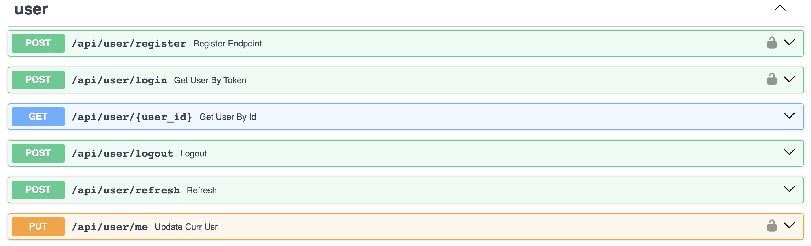

# User Microservice

## Introduction

This microservice manages all user-related operations, including user registration, login, and account management. It interacts with the User Interface microservice to handle user requests and ensure data consistency. It was implemented using FastAPI, a modern web framework for building APIs with Python. FastAPI’s asynchronous capabilities and automatic documen- tation generation simplify development and integration, making it an excellent choice for this microservice and PostgreSQL for the database, since the data is structured.

## API Endpoints

