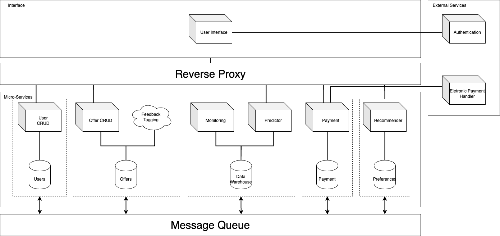

# Architecture

Compared to the previous milestone, the system architecture has remained essentially the same. However, there has been a significant change: the feedback and auto-tagging microservices have been moved to Microsoft Azure, where they now operate as APIs. This shift was driven by the challenges we faced when trying to run these microservices on our local machines. Migrating to Azure not only overcame these difficulties but also provided greater stability and scalability for these critical components of our system.
