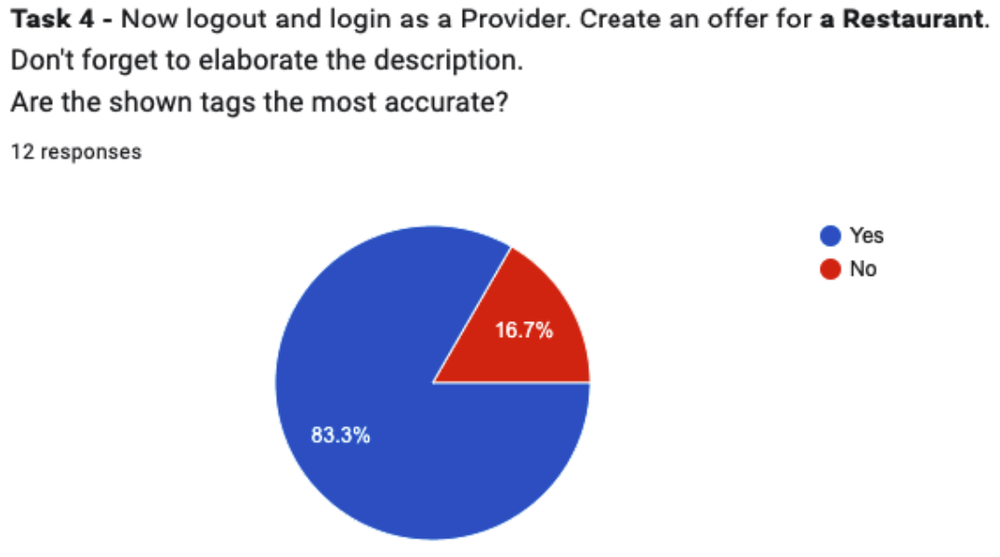
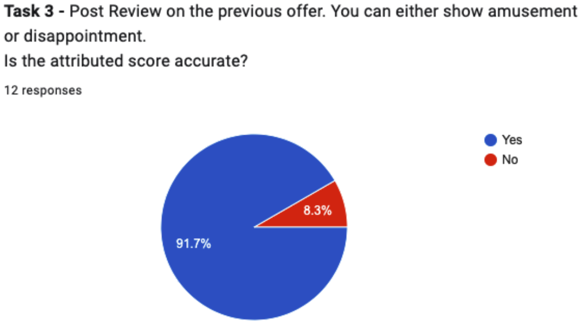
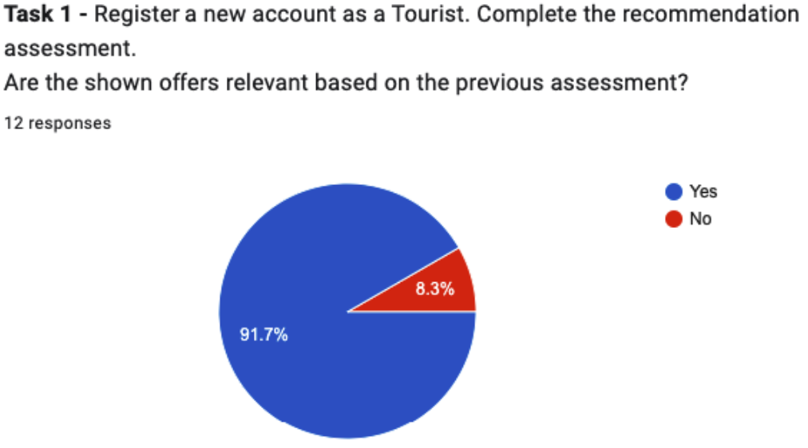

# Models Validation

## User Testing for Tag Evaluation

To assess the effectiveness and accuracy of the tags generated by the model, a series of user tests were conducted involving real users of the system. Participants were asked to create a provider account, generate an offer, and provide a description for the offer. Subsequently, the Auto-Tagging system would automatically assign tags to the offer based on its description.

After the tags were assigned, participants were prompted to review the tags suggested by the model and indicate whether they agreed or disagreed with the tags provided. This process aimed to gauge the alignment between the model’s tagging and the users’ perceptions of the offer content.

In total, 12 participants took part in the user testing phase. Upon reviewing the tags assigned by the model, the results indicated that 83.3% of the participants agreed with the tags suggested by the model, while 16.7% expressed disagreement with the assigned tags, as shown in the figure below.

The high percentage of participants who agreed with the model’s tags suggests a promising level of accuracy and alignment between the model’s predictions and the users’ expectations. However, the presence of dissenting opinions highlights the importance of ongoing refinement and optimization of the Auto-Tagging system to further enhance its accuracy and relevance.

Overall, the user testing phase provided valuable insights into the performance of the Auto-Tagging system and served as a foundation for iterative improvements aimed at optimizing the tagging process and enhancing user satisfaction.

## User Testing for Sentiment Analysis

To evaluate the efficacy of the sentiment analysis module, a similar user testing approach akin to the tag evaluation phase was undertaken. In this instance, participants were presented with a selection of user reviews associated with offers within the platform. These reviews had undergone sentiment analysis using the Vader Sentiment Analysis tool, resulting in sentiment scores indicative of the polarity and intensity of sentiments expressed in the reviews.

Participants were then tasked with reviewing the sentiment analysis results and indicating whether they concurred with the sentiment classifications assigned by the model. The goal was to ascertain the alignment between the sentiment analysis outcomes and the participants’ subjective interpretations of the sentiment expressed in the reviews.

Out of the 12 participants who partook in the user testing phase, an overwhelming majority—91.7%—concurred with the sentiment classifications derived from the Vader Sentiment Analysis, results shown in the figure below This high level of agreement underscores the robustness and accuracy of the sentiment analysis module in capturing and accurately representing user sentiments expressed in the feedback.

The positive reception of the sentiment analysis results affirms the efficacy of the Vader Sentiment Analysis tool in distilling actionable sentiment insights from user feedback, thereby empowering the system to proactively address user concerns and enhance overall user satisfaction levels.

## User Testing for Recommendation System

Usability testing was conducted to evaluate the effectiveness and user satisfaction with the recommendation mechanism implemented in the platform. Participants were instructed to create an account and engage with the platform, exploring the recommended offers presented to them.

During the usability testing phase, participants were asked to assess the suitability and relevance of the recommended offers presented to them. They were prompted to evaluate whether the offers aligned with their interests, preferences, and expectations.

## User Feedback Collection

After interacting with the platform and reviewing the recom- mended offers, participants were invited to provide feedback on their overall experience and the relevance of the recommendations. Open-ended questions were posed to gather qualitative insights into user perceptions and preferences regarding the recommendation system.

## Results

Out of the participants involved in the usability testing phase, an impressive 91.7% expressed satisfaction with the recommended offers presented to them. This high level of satisfaction underscores the effectiveness and accuracy of the recommendation mechanism in understanding and catering to the diverse preferences and interests of users.

## Implications

The positive feedback garnered from the usability testing affirms the efficacy of the recommendation system in enhancing user engagement and satisfaction. The high percentage of participants endorsing the relevance of the recommended offers highlights the system’s ability to deliver personalized and compelling recommendations that resonate with users’ preferences and interests.

## Continuous Improvement

Despite the positive feedback received, ongoing refinement and optimization of the recommendation system are essential to ensure its continued effectiveness and relevance. Insights gathered from usability testing, coupled with user feedback, serve as valuable inputs for iteratively enhancing the recommendation algorithms and fine-tuning the recommendation engine to deliver even more personalized and engaging recommendations in the future.
