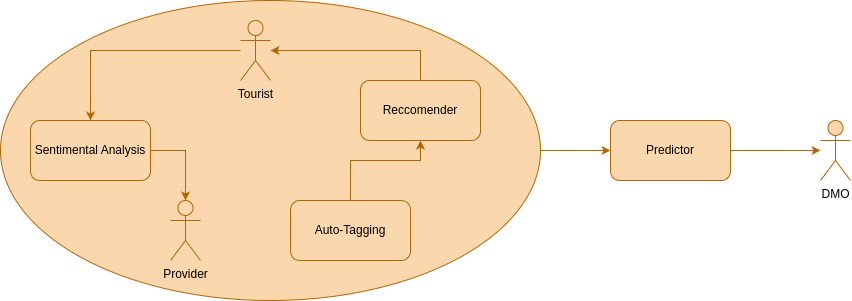

# Project Description

## Brief Overview of the Project

Trailblazer is a groundbreaking initiative aimed at revitalizing the tourism industry through the integration of Machine Learning (ML) and Natural Language Processing (NLP) technologies. By developing an advanced Destination Management System (DMS), Trailblazer seeks to empower Destination Management Organizations (DMOs) with predictive analytics to foresee trends and make informed decisions in infrastructure, marketing, and sustainability practices. The system analyzes tourists' feedback across various platforms to derive insights into preferences and sentiments, enhancing service quality and personalizing travel experiences. At its core, Trailblazer features a personalized recommendation engine that curates activities tailored to individual interests, fostering a seamless exploration of new experiences while enabling providers to effectively showcase their offerings. This multifaceted approach benefits tourists with customized travel suggestions, provides attraction providers with valuable market insights, and equips DMOs with sophisticated analytical tools for sustainable tourism development.

### Key Features

- **Personalized Recommendations**: Tailored travel suggestions based on individual preferences and interests.
- **Sentiment Analysis**: Derive insights from tourists' feedback to enhance service quality and personalizing travel experiences.
- **Predictive Analytics**: Empower Destination Management Organizations (DMOs) with predictive analytics to foresee trends and make informed decisions in infrastructure, marketing, and sustainability practices.
- **Sustainable Tourism Development**: Equips DMOs with sophisticated analytical tools for sustainable tourism development.
- **Curated Activities**: Foster a seamless exploration of new experiences while enabling providers to effectively showcase their offerings.
- **Market Insights**: Provides attraction providers with valuable market insights.
- **Service Quality Enhancement**: Enhance service quality and personalizing travel experiences.

### Project Schema

**Website**: [Trailblazer Website](To be added)

## Our Team

<table>
  <tr>
    <th>Nmec</th>
    <th>Name</th>
    <th>Email</th>
    <th>Github</th>
    <th>Roles</th>
  </tr>
  <tr>
    <td>107849</td>
    <td>Alexandre Cotorobai</td>
    <td><a href="mailto:alexandrecotorobai@ua.pt">alexandrecotorobai@ua.pt</a></td>
    <td><a href="https://github.com/AlexandreCotorobai">AlexandreCotorobai</a></td>
    <td>---</td>
  </tr>
  <tr>
    <td>108215</td>
    <td>Hugo Correia</td>
    <td><a href="mailto:hf.correia@ua.pt">hf.correia@ua.pt</a></td>
    <td><a href="https://github.com/MrLoydHD">MrLoydHD</a></td>
    <td>---</td>
  </tr>
  <tr>
    <td>109089</td>
    <td>Joaquim Rosa</td>
    <td><a href="mailto:joaquimvr15@ua.pt">joaquimvr15@ua.pt</a></td>
    <td><a href="https://github.com/JakeRosa">JakeRosa</a></td>
    <td>---</td>
  </tr>
  <tr>
    <td>108073</td>
    <td>Bernardo Figueiredo</td>
    <td><a href="mailto:bernardo.figueiredo@ua.pt">bernardo.figueiredo@ua.pt</a></td>
    <td><a href="https://github.com/LeikRad">LeikRad</a></td>
    <td>---</td>
  </tr>
  <tr>
    <td>107359</td>
    <td>Duarte Cruz</td>
    <td><a href="mailto:duarteccruz@ua.pt">duarteccruz@ua.pt</a></td>
    <td><a href="https://github.com/DuarteCruz31">DuarteCruz31</a></td>
    <td>---</td>
  </tr>
    <tr>
    <td>107637</td>
    <td>André Oliveira</td>
    <td><a href="mailto:andreaoliveira@ua.pt">andreaoliveira@ua.pt</a></td>
    <td><a href="https://github.com/andreaoliveira9">Andreaoliveira9</a></td>
    <td>---</td>
  </tr>
</table>

## Orienters

- **Professor** [Osvaldo Pacheco](https://www.ua.pt/pt/p/10313442)
- **Professor** [João Rafael Almeida](https://www.ua.pt/pt/p/80334491)
- **Dr.** [Daniel Ferreira](https://www.ua.pt/pt/p/80653922)
